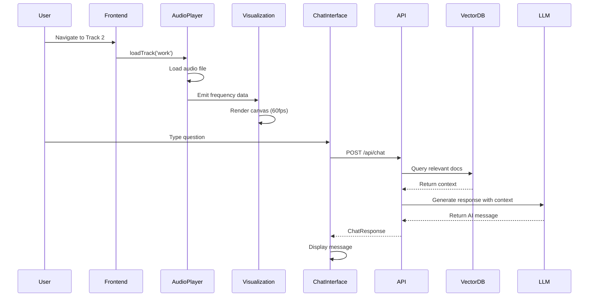

# Component Interaction Diagram

```mermaid
sequenceDiagram
    participant User
    participant Frontend
    participant AudioPlayer
    participant Visualization
    participant ChatInterface
    participant API
    participant VectorDB
    participant LLM

    User->>Frontend: Navigate to Track 2
    Frontend->>AudioPlayer: loadTrack('work')
    AudioPlayer->>AudioPlayer: Load audio file
    AudioPlayer->>Visualization: Emit frequency data
    Visualization->>Visualization: Render canvas (60fps)
    
    User->>ChatInterface: Type question
    ChatInterface->>API: POST /api/chat
    API->>VectorDB: Query relevant docs
    VectorDB-->>API: Return context
    API->>LLM: Generate response with context
    LLM-->>API: Return AI message
    API-->>ChatInterface: ChatResponse
    ChatInterface->>ChatInterface: Display message
```

---
