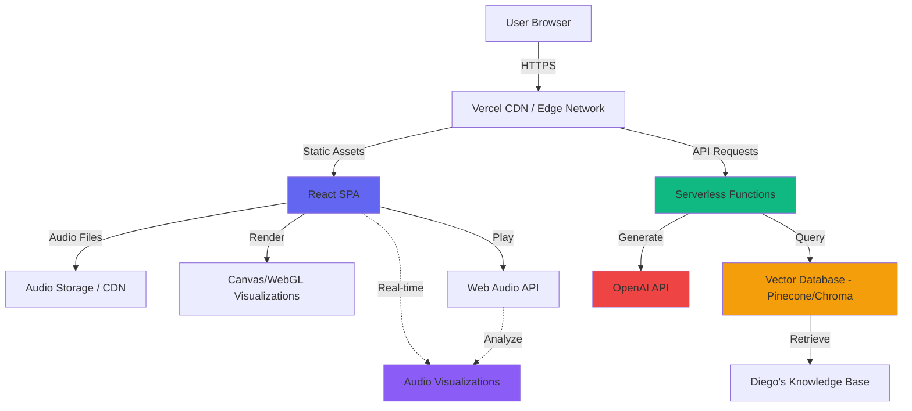

# High Level Architecture

## Technical Summary

Diego Portfolio is a **serverless fullstack application** combining a static React SPA with serverless API functions. The frontend leverages Web Audio API for real-time audio analysis and Canvas/WebGL for visualizations, while the backend provides AI-powered conversational capabilities through FastAPI, LangChain, and a vector database.

The architecture prioritizes:
- **Performance:** Code splitting, lazy loading, optimized audio/visual rendering
- **Scalability:** Serverless functions scale automatically with traffic
- **Cost-effectiveness:** Static hosting + pay-per-request serverless ideal for portfolio traffic patterns
- **Developer Experience:** TypeScript across frontend, Python for AI/backend, clear separation of concerns

The system supports the PRD's five-track music player metaphor with seamless navigation, persistent audio playback, and an AI "DJ" that provides contextual information about Diego's background.

## Platform and Infrastructure Choice

**Selected Platform:** **Vercel** (Frontend) + **Vercel Serverless Functions** (Backend API)

**Rationale:**
- **Unified deployment:** Single platform for frontend and backend simplifies CI/CD
- **Excellent DX:** Zero-config deployments, instant preview environments, automatic HTTPS
- **Optimal for React:** Built by Next.js team, excellent React/Vite support
- **Serverless Functions:** Native support for Python serverless functions
- **Edge Network:** Global CDN for fast asset delivery
- **Cost-effective:** Generous free tier, pay-as-you-grow pricing
- **TypeScript/Python native:** First-class support for both languages

**Key Services:**
- **Vercel Hosting:** Static site hosting with CDN
- **Vercel Serverless Functions:** Python API endpoints
- **Vercel Blob Storage:** Audio file storage (optional, or use external CDN)
- **External Vector DB:** Pinecone or hosted Chroma (Vercel functions connect to it)
- **Vercel Analytics:** Built-in performance monitoring

**Deployment Regions:** 
- Primary: Global Edge (Vercel's CDN)
- Serverless: Auto-selected based on user location (Vercel Edge Network)

**Alternative Consideration:**
If Vercel's free tier limits are exceeded, **Netlify** (similar offering) or **Firebase** (hosting + Cloud Functions) are suitable alternatives with minimal architecture changes.

## Repository Structure

**Structure:** Monorepo

**Monorepo Tool:** pnpm workspaces (lightweight, fast, native to Vercel)

**Package Organization:**
```
diego-portfolio/
├── apps/
│   ├── web/                 # React frontend
│   └── api/                 # Python serverless functions
├── packages/
│   └── shared/              # Shared TypeScript types
├── docs/                    # Project documentation
├── pnpm-workspace.yaml      # Workspace configuration
└── package.json             # Root package.json
```

**Rationale:**
- **Monorepo benefits:** Shared types between frontend/backend, atomic commits, simplified CI/CD
- **pnpm advantages:** Efficient disk usage, fast installs, native Vercel support
- **Clear boundaries:** Separate apps for frontend/backend, shared package for common code
- **Easy local development:** Single repository, unified tooling

## High Level Architecture Diagram



## Architectural Patterns

**1. Jamstack Architecture:** Static site generation with serverless APIs
- _Rationale:_ Optimal performance, security, and scalability for content-heavy sites with dynamic API needs

**2. Component-Based UI:** Reusable React components with TypeScript
- _Rationale:_ Maintainability, type safety, and clear component contracts across the application

**3. Repository Pattern:** Abstract data access for AI knowledge retrieval
- _Rationale:_ Flexibility to swap vector database providers without changing business logic

**4. API Gateway Pattern:** Single FastAPI entry point for all backend operations
- _Rationale:_ Centralized authentication, rate limiting, error handling, and logging

**5. Real-time Data Processing:** Web Audio API with requestAnimationFrame for visualizations
- _Rationale:_ Smooth 60fps animations synchronized with audio playback

**6. Retrieval-Augmented Generation (RAG):** Vector search + LLM for contextual AI responses
- _Rationale:_ Accurate, hallucination-resistant responses grounded in Diego's actual information

---
