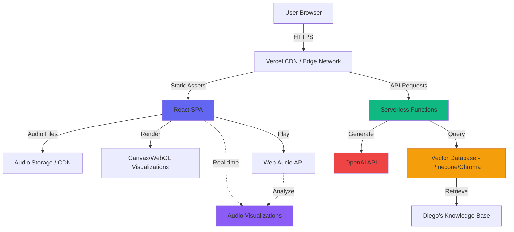
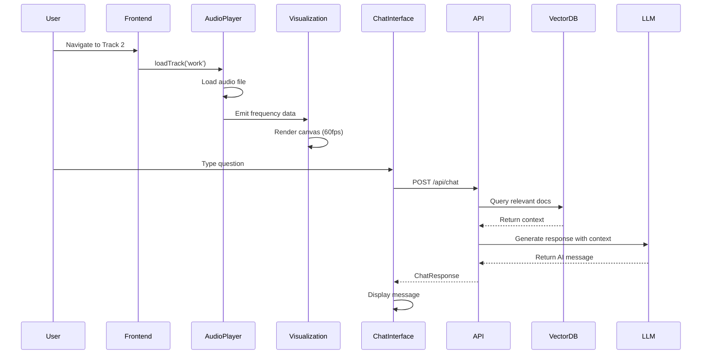

# Diego Portfolio - Fullstack Architecture Document

## Introduction

This document outlines the complete fullstack architecture for Diego Portfolio, including frontend implementation (React + Vite), backend services (FastAPI + AI), audio system design, and deployment infrastructure. It serves as the single source of truth for AI-driven development, ensuring consistency across the entire technology stack.

This unified approach combines frontend and backend architecture to streamline development for this modern fullstack application where these concerns are tightly integrated - particularly around the audio system, AI chatbot, and real-time visualizations.

### Starter Template or Existing Project

**Decision:** No starter template - greenfield project built from scratch

**Rationale:** 
- Unique requirements (audio visualizations, AI integration) don't align with standard templates
- Custom architecture needed for optimal performance
- Full control over dependencies and structure
- Educational value in building from foundation

**Setup Approach:**
```bash
# Frontend
npm create vite@latest diego-portfolio -- --template react-ts

# Backend
mkdir backend && cd backend
python -m venv venv
source venv/bin/activate  # On Windows: venv\Scripts\activate
pip install fastapi uvicorn langchain chromadb openai python-dotenv
```

### Change Log

| Date | Version | Description | Author |
|------|---------|-------------|--------|
| 2025-01-XX | 1.0 | Initial architecture design | Winston (Architect) |

---

## High Level Architecture

### Technical Summary

Diego Portfolio is a **serverless fullstack application** combining a static React SPA with serverless API functions. The frontend leverages Web Audio API for real-time audio analysis and Canvas/WebGL for visualizations, while the backend provides AI-powered conversational capabilities through FastAPI, LangChain, and a vector database.

The architecture prioritizes:
- **Performance:** Code splitting, lazy loading, optimized audio/visual rendering
- **Scalability:** Serverless functions scale automatically with traffic
- **Cost-effectiveness:** Static hosting + pay-per-request serverless ideal for portfolio traffic patterns
- **Developer Experience:** TypeScript across frontend, Python for AI/backend, clear separation of concerns

The system supports the PRD's five-track music player metaphor with seamless navigation, persistent audio playback, and an AI "DJ" that provides contextual information about Diego's background.

### Platform and Infrastructure Choice

**Selected Platform:** **Vercel** (Frontend) + **Vercel Serverless Functions** (Backend API)

**Rationale:**
- **Unified deployment:** Single platform for frontend and backend simplifies CI/CD
- **Excellent DX:** Zero-config deployments, instant preview environments, automatic HTTPS
- **Optimal for React:** Built by Next.js team, excellent React/Vite support
- **Serverless Functions:** Native support for Python serverless functions
- **Edge Network:** Global CDN for fast asset delivery
- **Cost-effective:** Generous free tier, pay-as-you-grow pricing
- **TypeScript/Python native:** First-class support for both languages

**Key Services:**
- **Vercel Hosting:** Static site hosting with CDN
- **Vercel Serverless Functions:** Python API endpoints
- **Vercel Blob Storage:** Audio file storage (optional, or use external CDN)
- **External Vector DB:** Pinecone or hosted Chroma (Vercel functions connect to it)
- **Vercel Analytics:** Built-in performance monitoring

**Deployment Regions:** 
- Primary: Global Edge (Vercel's CDN)
- Serverless: Auto-selected based on user location (Vercel Edge Network)

**Alternative Consideration:**
If Vercel's free tier limits are exceeded, **Netlify** (similar offering) or **Firebase** (hosting + Cloud Functions) are suitable alternatives with minimal architecture changes.

### Repository Structure

**Structure:** Monorepo

**Monorepo Tool:** pnpm workspaces (lightweight, fast, native to Vercel)

**Package Organization:**
```
diego-portfolio/
├── apps/
│   ├── web/                 # React frontend
│   └── api/                 # Python serverless functions
├── packages/
│   └── shared/              # Shared TypeScript types
├── docs/                    # Project documentation
├── pnpm-workspace.yaml      # Workspace configuration
└── package.json             # Root package.json
```

**Rationale:**
- **Monorepo benefits:** Shared types between frontend/backend, atomic commits, simplified CI/CD
- **pnpm advantages:** Efficient disk usage, fast installs, native Vercel support
- **Clear boundaries:** Separate apps for frontend/backend, shared package for common code
- **Easy local development:** Single repository, unified tooling

### High Level Architecture Diagram



### Architectural Patterns

**1. Jamstack Architecture:** Static site generation with serverless APIs
- _Rationale:_ Optimal performance, security, and scalability for content-heavy sites with dynamic API needs

**2. Component-Based UI:** Reusable React components with TypeScript
- _Rationale:_ Maintainability, type safety, and clear component contracts across the application

**3. Repository Pattern:** Abstract data access for AI knowledge retrieval
- _Rationale:_ Flexibility to swap vector database providers without changing business logic

**4. API Gateway Pattern:** Single FastAPI entry point for all backend operations
- _Rationale:_ Centralized authentication, rate limiting, error handling, and logging

**5. Real-time Data Processing:** Web Audio API with requestAnimationFrame for visualizations
- _Rationale:_ Smooth 60fps animations synchronized with audio playback

**6. Retrieval-Augmented Generation (RAG):** Vector search + LLM for contextual AI responses
- _Rationale:_ Accurate, hallucination-resistant responses grounded in Diego's actual information

---

## Tech Stack

This is the **DEFINITIVE** technology selection for the entire project. All development must use these exact versions.

### Technology Stack Table

| Category | Technology | Version | Purpose | Rationale |
|----------|------------|---------|---------|-----------|
| **Frontend Language** | TypeScript | 5.3.x | Primary development language | Type safety, excellent tooling, prevents bugs |
| **Frontend Framework** | React | 18.2.x | UI library | Component-based, mature ecosystem, team familiarity |
| **Build Tool** | Vite | 5.0.x | Dev server and bundler | Fast HMR, optimal builds, native TypeScript support |
| **UI Component Library** | Headless UI | 1.7.x | Accessible primitives | Unstyled, accessible, integrates with Tailwind |
| **State Management** | Zustand | 4.4.x | Global state | Lightweight, simple API, TypeScript-first |
| **Routing** | React Router | 6.21.x | Client-side routing | Industry standard, v6 improvements, loader pattern |
| **Styling** | TailwindCSS | 3.4.x | Utility-first CSS | Rapid development, consistent design, JIT mode |
| **HTTP Client** | Axios | 1.6.x | API requests | Interceptors, better error handling than fetch |
| **Audio Processing** | Web Audio API | Native | Audio analysis | Browser-native, powerful, no dependencies |
| **Visualizations** | Canvas API | Native | 2D rendering | Performant, lightweight, sufficient for visualizations |
| **Icons** | Lucide React | 0.303.x | Icon system | Consistent, tree-shakable, matches UX spec |
| **Forms** | React Hook Form | 7.49.x | Form management | Minimal re-renders, validation, chat input |
| **Backend Language** | Python | 3.11.x | Backend runtime | AI/ML ecosystem, FastAPI native, Diego's expertise |
| **Backend Framework** | FastAPI | 0.108.x | API framework | Fast, async, automatic OpenAPI docs, type hints |
| **AI Orchestration** | LangChain | 0.1.x | RAG pipeline | Modular AI components, vector store integrations |
| **Vector Database** | Pinecone | Latest | Embeddings storage | Managed, scalable, free tier, simple API |
| **LLM Provider** | OpenAI | 1.6.x | Chat completion | GPT-4 Turbo for accuracy, embeddings for RAG |
| **Validation** | Pydantic | 2.5.x | Data validation | Type-safe, FastAPI native, prevents errors |
| **CORS** | fastapi.middleware.cors | Built-in | Cross-origin requests | Enable frontend-backend communication |
| **Environment** | python-dotenv | 1.0.x | Env variable loading | Secure config management |
| **Frontend Testing** | Vitest | 1.1.x | Unit testing | Vite-native, fast, Jest-compatible API |
| **Component Testing** | React Testing Library | 14.1.x | Component tests | Best practices, user-centric testing |
| **Backend Testing** | pytest | 7.4.x | Python unit/integration tests | Standard Python testing, async support |
| **E2E Testing** | Playwright | 1.40.x | End-to-end tests | Cross-browser, reliable, great DX |
| **Linting** | ESLint | 8.56.x | Code quality (JS/TS) | Catch errors, enforce standards |
| **Formatting** | Prettier | 3.1.x | Code formatting | Consistent style, automatic |
| **Package Manager** | pnpm | 8.14.x | Dependency management | Fast, efficient, workspace support |
| **Deployment** | Vercel | Latest | Hosting platform | Frontend + serverless functions unified |
| **Version Control** | Git | Latest | Source control | Industry standard |
| **CI/CD** | GitHub Actions | Latest | Automation | Free for public repos, Vercel integration |
| **Monitoring** | Vercel Analytics | Built-in | Performance tracking | Zero-config, Core Web Vitals |
| **Error Tracking** | Sentry | 7.91.x | Error monitoring | Frontend + backend, source maps |

---

## Data Models

### Shared TypeScript Interfaces

These interfaces are defined in `packages/shared/src/types/` and shared between frontend and backend (FastAPI Pydantic models mirror these).

#### Track Model

```typescript
// packages/shared/src/types/Track.ts

export type TrackId = 'university' | 'work' | 'projects' | 'skills' | 'hobbies';

export interface Track {
  id: TrackId;
  number: number;
  title: string;
  description: string;
  audioUrl: string;
  duration: number; // in seconds
  mood: string; // e.g., "Foundation & Learning", "Professional Growth"
  backgroundColor?: string; // Optional custom background color
}

export const TRACKS: Track[] = [
  {
    id: 'university',
    number: 1,
    title: 'University Years',
    description: 'Foundation & Learning',
    audioUrl: '/audio/track-1-university.mp3',
    duration: 180,
    mood: 'foundation',
  },
  // ... other tracks
];
```

**Purpose:** Represents each of the 5 portfolio tracks/sections

**Relationships:**
- Has associated content (rendered by track-specific components)
- Has audio file (played via AudioPlayer)
- Referenced in navigation and playback state

---

#### Project Model

```typescript
// packages/shared/src/types/Project.ts

export interface Project {
  id: string;
  title: string;
  description: string;
  longDescription?: string;
  techStack: string[]; // e.g., ['React', 'TypeScript', 'FastAPI']
  tags: string[]; // e.g., ['Web', 'AI', 'Full-Stack']
  imageUrl?: string;
  demoUrl?: string;
  githubUrl?: string;
  caseStudyUrl?: string;
  featured: boolean;
  completedDate: string; // ISO date string
}
```

**Purpose:** Represents Diego's projects showcased in Track 3

**Relationships:**
- Displayed as ProjectCards in Track 3
- Clicked projects open ProjectDetailModal
- Filterable by techStack or tags

---

#### ChatMessage Model

```typescript
// packages/shared/src/types/Chat.ts

export type MessageRole = 'user' | 'assistant' | 'system';

export interface ChatMessage {
  id: string;
  role: MessageRole;
  content: string;
  timestamp: number; // Unix timestamp
  isExpanded?: boolean; // For two-tier responses
  detailedContent?: string; // Extended response content
  suggestedQuestions?: string[]; // Follow-up suggestions
}

export interface ChatConversation {
  id: string;
  messages: ChatMessage[];
  createdAt: number;
  updatedAt: number;
}

export interface ChatRequest {
  message: string;
  conversationHistory: ChatMessage[];
}

export interface ChatResponse {
  message: ChatMessage;
  suggestedQuestions: string[];
}
```

**Purpose:** Represents AI DJ chat messages and conversations

**Relationships:**
- ChatConversation contains array of ChatMessages
- ChatRequest sent to backend API
- ChatResponse received from backend, appended to conversation

---

#### AudioState Model

```typescript
// packages/shared/src/types/Audio.ts

export type PlaybackState = 'playing' | 'paused' | 'loading' | 'error';

export interface AudioState {
  currentTrack: TrackId | null;
  playbackState: PlaybackState;
  currentTime: number; // seconds
  duration: number; // seconds
  volume: number; // 0-1
  isMuted: boolean;
  isShuffleOn: boolean;
  visualizationData: {
    frequencyData: Uint8Array;
    timeDomainData: Uint8Array;
  } | null;
}
```

**Purpose:** Global audio playback state managed by Zustand

**Relationships:**
- Consumed by AudioPlayer component
- Consumed by Visualization components
- Updated by audio event handlers

---

## API Specification

### REST API Endpoints

Base URL: `https://diego-portfolio.vercel.app/api`

#### POST /api/chat

**Purpose:** Send a message to the AI DJ chatbot

**Request:**
```typescript
{
  message: string;           // User's question
  conversationHistory: ChatMessage[];  // Previous messages for context
}
```

**Response (200 OK):**
```typescript
{
  message: {
    id: string;
    role: 'assistant';
    content: string;         // AI DJ's response (summary)
    timestamp: number;
    detailedContent?: string; // Expanded response (if applicable)
    suggestedQuestions: string[];
  };
  suggestedQuestions: string[];  // Array of 3-5 follow-up questions
}
```

**Response (429 Too Many Requests):**
```typescript
{
  error: "Rate limit exceeded. Please wait before sending another message.";
}
```

**Response (500 Internal Server Error):**
```typescript
{
  error: "AI DJ is temporarily unavailable. Please try again later.";
}
```

**Authentication:** None (public endpoint with rate limiting)

**Rate Limiting:** 10 requests per minute per IP address

**Example Request:**
```bash
curl -X POST https://diego-portfolio.vercel.app/api/chat \
  -H "Content-Type: application/json" \
  -d '{
    "message": "What programming languages does Diego know?",
    "conversationHistory": []
  }'
```

---

#### GET /api/health

**Purpose:** Health check endpoint for monitoring

**Response (200 OK):**
```typescript
{
  status: 'healthy';
  timestamp: number;
  version: string;
}
```

---

## Components

### Frontend Component Architecture

The frontend is organized into a clear component hierarchy with separation of concerns.

#### Component: App

**Responsibility:** Root component, routing setup, global providers

**Key Interfaces:**
- Routes configuration
- Global state providers (Zustand, Theme)
- Error boundaries

**Dependencies:** React Router, Zustand stores

**Technology Stack:** React 18, TypeScript, React Router v6

---

#### Component: AudioPlayer

**Responsibility:** Global audio playback controls and state management

**Key Interfaces:**
- `play(): void` - Start playback
- `pause(): void` - Pause playback
- `seek(time: number): void` - Jump to specific time
- `setVolume(volume: number): void` - Adjust volume (0-1)
- `toggleMute(): void` - Mute/unmute
- `loadTrack(trackId: TrackId): void` - Load new track audio

**Dependencies:** 
- Zustand audio store
- Web Audio API
- Browser HTMLAudioElement

**Technology Stack:** React, Web Audio API, Zustand

**Implementation Note:** Uses Web Audio API AudioContext for analysis while playing audio through HTMLAudioElement for reliability.

---

#### Component: Visualization

**Responsibility:** Real-time audio-reactive visual display using Canvas

**Key Interfaces:**
- Props: `frequencyData: Uint8Array`, `style: 'bars' | 'waveform' | 'radial'`
- Renders to Canvas element
- Updates at 60fps using requestAnimationFrame

**Dependencies:**
- Audio state from Zustand (frequency/time domain data)
- Canvas 2D rendering context

**Technology Stack:** React, Canvas API, requestAnimationFrame

**Performance:** Optimized rendering, only updates when audio playing, uses offscreen canvas if needed

---

#### Component: TrackView

**Responsibility:** Display individual track content with layout and navigation

**Key Interfaces:**
- Props: `trackId: TrackId`
- Renders track header, content, audio controls
- Handles track navigation

**Dependencies:**
- Track data (from TRACKS constant)
- AudioPlayer component
- Visualization component
- Navigation components

**Technology Stack:** React, React Router, TailwindCSS

---

#### Component: ChatInterface

**Responsibility:** AI DJ chat UI, message display, user input

**Key Interfaces:**
- `sendMessage(message: string): Promise<void>`
- Displays conversation history
- Handles message submission
- Shows typing indicator

**Dependencies:**
- Axios for API calls
- Chat state (local or Zustand)

**Technology Stack:** React, Axios, React Hook Form

---

#### Component: ProjectCard & ProjectDetailModal

**Responsibility:** Display project information, handle detail view

**Key Interfaces:**
- ProjectCard Props: `project: Project`, `onClick: () => void`
- Modal Props: `project: Project`, `isOpen: boolean`, `onClose: () => void`

**Dependencies:**
- Headless UI for modal
- Project data

**Technology Stack:** React, Headless UI, TailwindCSS

---

### Backend Component Architecture

#### Component: ChatRouter (FastAPI Router)

**Responsibility:** Handle chat API endpoints

**Key Interfaces:**
- POST `/api/chat` endpoint
- Request validation (Pydantic models)
- Response formatting

**Dependencies:**
- ChatService
- Rate limiting middleware

**Technology Stack:** FastAPI, Pydantic

---

#### Component: ChatService

**Responsibility:** Business logic for AI chat interactions

**Key Interfaces:**
- `async process_message(message: str, history: List[Message]) -> ChatResponse`
- Orchestrates RAG pipeline
- Formats responses

**Dependencies:**
- VectorStoreService
- LLMService

**Technology Stack:** LangChain, Python async

---

#### Component: VectorStoreService

**Responsibility:** Vector database operations (embed, store, query)

**Key Interfaces:**
- `async query(text: str, k: int) -> List[Document]`
- Retrieves relevant context from knowledge base

**Dependencies:**
- Pinecone client
- OpenAI embeddings

**Technology Stack:** LangChain, Pinecone, OpenAI

---

#### Component: LLMService

**Responsibility:** LLM API calls and response generation

**Key Interfaces:**
- `async generate_response(query: str, context: str, history: List[Message]) -> str`
- Constructs prompts with system instructions
- Handles streaming responses (if needed)

**Dependencies:**
- OpenAI API client
- Prompt templates

**Technology Stack:** LangChain, OpenAI GPT-4 Turbo

---

## Component Interaction Diagram



---

## Database Schema

### Vector Database (Pinecone)

**Index Name:** `diego-portfolio-knowledge`

**Dimensions:** 1536 (OpenAI text-embedding-3-small)

**Metric:** Cosine similarity

**Document Structure:**
```python
{
  "id": "doc_123",          # Unique document ID
  "values": [0.1, 0.2, ...], # 1536-dim embedding vector
  "metadata": {
    "text": str,            # Original text chunk
    "source": str,          # e.g., "resume", "project_xyz"
    "category": str,        # e.g., "education", "work", "skills"
    "date": str,            # ISO date if applicable
  }
}
```

**Knowledge Base Categories:**
- **resume:** Career summary, work history
- **education:** University, degrees, coursework
- **projects:** Project descriptions, technologies, outcomes
- **skills:** Technical skills with proficiency levels
- **interests:** Hobbies, music, personal interests

**Chunking Strategy:**
- Max chunk size: 500 tokens
- Overlap: 50 tokens
- Preserve semantic boundaries (don't split mid-sentence)

**Query Process:**
1. User question embedded with OpenAI
2. Vector similarity search (top-k=5)
3. Retrieved chunks passed as context to LLM
4. LLM generates grounded response

---

## Source Tree

### Unified Project Structure

```
diego-portfolio/
├── .github/
│   └── workflows/
│       ├── ci.yml                    # Run tests on PR
│       └── deploy.yml                # Deploy to Vercel on merge
│
├── apps/
│   ├── web/                          # Frontend React application
│   │   ├── public/
│   │   │   ├── audio/                # Audio files for each track
│   │   │   │   ├── track-1-university.mp3
│   │   │   │   ├── track-2-work.mp3
│   │   │   │   ├── track-3-projects.mp3
│   │   │   │   ├── track-4-skills.mp3
│   │   │   │   └── track-5-hobbies.mp3
│   │   │   ├── images/               # Static images
│   │   │   └── favicon.ico
│   │   │
│   │   ├── src/
│   │   │   ├── components/           # Reusable UI components
│   │   │   │   ├── audio/
│   │   │   │   │   ├── AudioPlayer.tsx
│   │   │   │   │   ├── AudioControls.tsx
│   │   │   │   │   └── Visualization.tsx
│   │   │   │   ├── chat/
│   │   │   │   │   ├── ChatInterface.tsx
│   │   │   │   │   ├── ChatMessage.tsx
│   │   │   │   │   └── ChatInput.tsx
│   │   │   │   ├── navigation/
│   │   │   │   │   ├── TrackList.tsx
│   │   │   │   │   ├── TrackNavigation.tsx
│   │   │   │   │   └── ShuffleButton.tsx
│   │   │   │   ├── projects/
│   │   │   │   │   ├── ProjectCard.tsx
│   │   │   │   │   ├── ProjectGrid.tsx
│   │   │   │   │   └── ProjectDetailModal.tsx
│   │   │   │   ├── tracks/
│   │   │   │   │   ├── TrackCard.tsx
│   │   │   │   │   └── TrackHeader.tsx
│   │   │   │   └── ui/               # Shared UI primitives
│   │   │   │       ├── Button.tsx
│   │   │   │       ├── Modal.tsx
│   │   │   │       └── Card.tsx
│   │   │   │
│   │   │   ├── pages/                # Page components/routes
│   │   │   │   ├── AlbumView.tsx     # Landing page
│   │   │   │   ├── TrackView.tsx     # Individual track pages
│   │   │   │   └── NotFound.tsx      # 404 page
│   │   │   │
│   │   │   ├── hooks/                # Custom React hooks
│   │   │   │   ├── useAudioPlayer.ts
│   │   │   │   ├── useVisualization.ts
│   │   │   │   ├── useChat.ts
│   │   │   │   └── useKeyboardShortcuts.ts
│   │   │   │
│   │   │   ├── stores/               # Zustand state stores
│   │   │   │   ├── audioStore.ts     # Audio playback state
│   │   │   │   └── chatStore.ts      # Chat conversation state
│   │   │   │
│   │   │   ├── services/             # API client services
│   │   │   │   └── chatService.ts    # Axios API calls
│   │   │   │
│   │   │   ├── utils/                # Utility functions
│   │   │   │   ├── audioUtils.ts     # Audio processing helpers
│   │   │   │   ├── visualizationUtils.ts
│   │   │   │   └── formatters.ts     # Date, time formatting
│   │   │   │
│   │   │   ├── styles/               # Global styles
│   │   │   │   └── globals.css       # Tailwind imports, custom CSS
│   │   │   │
│   │   │   ├── data/                 # Static data
│   │   │   │   ├── tracks.ts         # TRACKS constant
│   │   │   │   ├── projects.ts       # PROJECTS constant
│   │   │   │   └── skills.ts         # SKILLS constant
│   │   │   │
│   │   │   ├── App.tsx               # Root component
│   │   │   ├── main.tsx              # Entry point
│   │   │   └── vite-env.d.ts         # Vite type declarations
│   │   │
│   │   ├── tests/                    # Frontend tests
│   │   │   ├── unit/                 # Component unit tests
│   │   │   ├── integration/          # Integration tests
│   │   │   └── e2e/                  # Playwright E2E tests
│   │   │
│   │   ├── .env.example              # Environment variables template
│   │   ├── .env.local                # Local env (gitignored)
│   │   ├── index.html                # HTML entry point
│   │   ├── package.json
│   │   ├── tsconfig.json             # TypeScript config
│   │   ├── tsconfig.node.json
│   │   ├── vite.config.ts            # Vite configuration
│   │   ├── tailwind.config.js        # Tailwind configuration
│   │   ├── postcss.config.js
│   │   └── README.md
│   │
│   └── api/                          # Backend Python serverless functions
│       ├── chat.py                   # POST /api/chat endpoint
│       ├── health.py                 # GET /api/health endpoint
│       │
│       ├── services/
│       │   ├── chat_service.py       # Chat business logic
│       │   ├── vector_store_service.py # Pinecone operations
│       │   └── llm_service.py        # OpenAI LLM calls
│       │
│       ├── models/
│       │   └── schemas.py            # Pydantic models
│       │
│       ├── utils/
│       │   ├── prompts.py            # System prompt templates
│       │   └── rate_limit.py         # Rate limiting logic
│       │
│       ├── scripts/
│       │   ├── ingest_knowledge.py   # Script to populate vector DB
│       │   └── test_embeddings.py    # Test vector search
│       │
│       ├── data/
│       │   ├── resume.txt            # Source data for embeddings
│       │   ├── projects.txt
│       │   ├── skills.txt
│       │   └── interests.txt
│       │
│       ├── requirements.txt          # Python dependencies
│       ├── .env.example
│       ├── .env                      # Local env (gitignored)
│       └── README.md
│
├── packages/
│   └── shared/                       # Shared TypeScript types
│       ├── src/
│       │   └── types/
│       │       ├── Track.ts
│       │       ├── Project.ts
│       │       ├── Chat.ts
│       │       └── Audio.ts
│       ├── package.json
│       ├── tsconfig.json
│       └── README.md
│
├── docs/                             # Project documentation
│   ├── prd.md                        # Product Requirements Document
│   ├── front-end-spec.md             # UI/UX Specification
│   ├── architecture.md               # This document
│   └── brainstorming-session-results.md
│
├── scripts/                          # Build/utility scripts
│   └── setup-local.sh                # Local development setup
│
├── .gitignore
├── .prettierrc                       # Prettier configuration
├── .eslintrc.json                    # ESLint configuration
├── pnpm-workspace.yaml               # pnpm workspace config
├── package.json                      # Root package.json
├── vercel.json                       # Vercel deployment config
└── README.md                         # Project overview
```

---

## Development Workflow

### Local Development Setup

#### Prerequisites
```bash
# Required software
- Node.js 18+ (with npm/npx)
- pnpm 8+ (npm install -g pnpm)
- Python 3.11+
- Git
```

#### Initial Setup
```bash
# Clone repository
git clone https://github.com/diego/portfolio.git
cd diego-portfolio

# Install frontend dependencies
pnpm install

# Set up backend
cd apps/api
python -m venv venv
source venv/bin/activate  # Windows: venv\Scripts\activate
pip install -r requirements.txt

# Copy environment files
cp apps/web/.env.example apps/web/.env.local
cp apps/api/.env.example apps/api/.env

# Configure environment variables (see below)
# Edit .env.local and .env with your values
```

#### Environment Configuration

**Frontend (.env.local):**
```bash
# API endpoint (local development)
VITE_API_URL=http://localhost:8000/api

# Analytics (optional for local)
VITE_VERCEL_ANALYTICS_ID=
```

**Backend (.env):**
```bash
# OpenAI API
OPENAI_API_KEY=sk-...

# Pinecone
PINECONE_API_KEY=...
PINECONE_ENVIRONMENT=...
PINECONE_INDEX_NAME=diego-portfolio-knowledge

# Application
ENVIRONMENT=development
ALLOWED_ORIGINS=http://localhost:5173,http://localhost:3000

# Rate Limiting
RATE_LIMIT_PER_MINUTE=10
```

#### Development Commands

**Start Frontend (from root):**
```bash
pnpm --filter web dev
# Runs on http://localhost:5173
```

**Start Backend (from apps/api):**
```bash
source venv/bin/activate
uvicorn chat:app --reload --port 8000
# Runs on http://localhost:8000
```

**Run All Tests:**
```bash
# Frontend tests
pnpm --filter web test

# Backend tests
cd apps/api && pytest

# E2E tests
pnpm --filter web test:e2e
```

**Lint and Format:**
```bash
# Lint all code
pnpm lint

# Format all code
pnpm format
```

---

## Deployment Architecture

### Deployment Strategy

**Frontend Deployment:**
- **Platform:** Vercel
- **Build Command:** `pnpm --filter web build`
- **Output Directory:** `apps/web/dist`
- **CDN/Edge:** Vercel Edge Network (global)

**Backend Deployment:**
- **Platform:** Vercel Serverless Functions
- **Runtime:** Python 3.11
- **Function Location:** `apps/api/*.py`
- **Deployment Method:** Automatic via Vercel CLI or Git integration

**Deployment Triggers:**
- Push to `main` branch → Production deployment
- Pull requests → Preview deployments
- Manual deploys via Vercel CLI

### CI/CD Pipeline

**GitHub Actions Workflow:**

```yaml
# .github/workflows/ci.yml
name: CI

on:
  pull_request:
    branches: [main, develop]
  push:
    branches: [main]

jobs:
  test-frontend:
    runs-on: ubuntu-latest
    steps:
      - uses: actions/checkout@v4
      - uses: pnpm/action-setup@v2
        with:
          version: 8
      - uses: actions/setup-node@v4
        with:
          node-version: 18
          cache: 'pnpm'
      - run: pnpm install
      - run: pnpm --filter web test
      - run: pnpm --filter web build

  test-backend:
    runs-on: ubuntu-latest
    steps:
      - uses: actions/checkout@v4
      - uses: actions/setup-python@v4
        with:
          python-version: '3.11'
      - run: cd apps/api && pip install -r requirements.txt
      - run: cd apps/api && pytest

  e2e:
    runs-on: ubuntu-latest
    needs: [test-frontend, test-backend]
    steps:
      - uses: actions/checkout@v4
      - uses: pnpm/action-setup@v2
      - uses: actions/setup-node@v4
      - run: pnpm install
      - run: pnpm --filter web test:e2e
```

**Vercel Deployment:**
```json
// vercel.json
{
  "buildCommand": "pnpm install && pnpm --filter web build",
  "devCommand": "pnpm --filter web dev",
  "installCommand": "pnpm install",
  "framework": "vite",
  "outputDirectory": "apps/web/dist",
  "functions": {
    "apps/api/*.py": {
      "runtime": "python3.11"
    }
  },
  "rewrites": [
    {
      "source": "/api/:path*",
      "destination": "/apps/api/:path*"
    }
  ]
}
```

### Environments

| Environment | Frontend URL | Backend URL | Purpose |
|-------------|-------------|-------------|---------|
| **Development** | http://localhost:5173 | http://localhost:8000 | Local development |
| **Preview** | https://diego-portfolio-*-preview.vercel.app | Same (serverless) | PR previews, testing |
| **Production** | https://diego-portfolio.vercel.app | Same (serverless) | Live environment |

---

## Security and Performance

### Security Requirements

**Frontend Security:**
- **Content Security Policy (CSP):** Configure in Vercel headers
  ```
  Content-Security-Policy: default-src 'self'; script-src 'self' 'unsafe-inline'; style-src 'self' 'unsafe-inline'; img-src 'self' data: https:; media-src 'self' https:; connect-src 'self' https://diego-portfolio.vercel.app;
  ```
- **HTTPS Only:** Enforced by Vercel
- **XSS Prevention:** React's built-in escaping, avoid dangerouslySetInnerHTML
- **CORS Configuration:** Backend only accepts requests from production domain

**Backend Security:**
- **API Rate Limiting:** 10 requests/minute per IP (configurable)
  ```python
  from fastapi import Request
  from slowapi import Limiter
  from slowapi.util import get_remote_address
  
  limiter = Limiter(key_func=get_remote_address)
  
  @app.post("/api/chat")
  @limiter.limit("10/minute")
  async def chat_endpoint(request: Request, ...):
      ...
  ```
- **Input Validation:** Pydantic models validate all inputs
- **Secrets Management:** Environment variables, never in code
- **CORS Policy:** Whitelist production domains only
  ```python
  app.add_middleware(
      CORSMiddleware,
      allow_origins=["https://diego-portfolio.vercel.app"],
      allow_methods=["POST", "GET"],
      allow_headers=["Content-Type"],
  )
  ```

**Data Protection:**
- **No Sensitive Data:** Portfolio is public, no user auth or PII
- **API Keys:** Stored as Vercel environment variables
- **Logs:** No sensitive information logged

### Performance Optimization

**Frontend Performance:**

**Bundle Size Target:** < 200KB initial JS (gzipped)

**Techniques:**
- **Code Splitting:** Route-based splitting with React.lazy
  ```typescript
  const TrackView = lazy(() => import('./pages/TrackView'));
  const ChatInterface = lazy(() => import('./components/chat/ChatInterface'));
  ```
- **Tree Shaking:** Vite automatically removes unused code
- **Asset Optimization:**
  - Images: WebP format, lazy loading, responsive srcset
  - Audio: MP3 compressed to 128-192kbps, progressive streaming
- **Caching:** Static assets cached with long TTL (Vercel CDN)

**Runtime Performance:**
- **Visualization Optimization:**
  ```typescript
  // Use RAF for smooth 60fps
  const animate = () => {
    if (!isPlaying) return;
    
    analyser.getByteFrequencyData(frequencyData);
    drawVisualization(frequencyData);
    
    requestAnimationFrame(animate);
  };
  ```
- **Memoization:** React.memo for expensive components
- **Virtual Scrolling:** Not needed (content fits on screen)

**Backend Performance:**
- **Response Time Target:** < 2 seconds for chat API
- **Vector Search:** Pinecone optimized for < 50ms queries
- **LLM Streaming:** Consider streaming responses for < 1s perceived latency
- **Caching:** Cache common questions (Redis if needed in future)

**Monitoring:**
- **Vercel Analytics:** Core Web Vitals tracked automatically
- **Sentry:** Error tracking for frontend + backend
- **Custom Metrics:**
  - API response times
  - Chat satisfaction (implicit via conversation length)
  - Track navigation patterns

---

## Error Handling Strategy

### General Approach

**Error Model:** Structured error responses with user-friendly messages

**Exception Hierarchy:**
- **Validation Errors:** 400 Bad Request (Pydantic handles this)
- **Rate Limit Errors:** 429 Too Many Requests
- **Server Errors:** 500 Internal Server Error (catch-all)

**Error Propagation:** Backend returns consistent error JSON, frontend displays user-friendly messages

### Logging Standards

**Library:** 
- Frontend: console (dev), Sentry (production)
- Backend: Python logging module + Sentry

**Log Format:**
```python
# Backend
import logging

logging.basicConfig(
    level=logging.INFO,
    format='%(asctime)s - %(name)s - %(levelname)s - %(message)s'
)

logger = logging.getLogger(__name__)
```

**Levels:**
- **DEBUG:** Detailed technical info (only in development)
- **INFO:** General flow, successful operations
- **WARNING:** Potential issues, degraded performance
- **ERROR:** Errors that don't stop the service
- **CRITICAL:** Service-breaking errors

**Required Context:**
- Request ID (for tracing)
- User IP (for rate limiting debugging)
- Endpoint path
- Error stack traces (in production, sent to Sentry)

### Error Handling Patterns

#### External API Errors (OpenAI, Pinecone)

**Retry Policy:**
```python
from tenacity import retry, stop_after_attempt, wait_exponential

@retry(
    stop=stop_after_attempt(3),
    wait=wait_exponential(multiplier=1, min=2, max=10)
)
async def call_openai_api(prompt: str):
    # OpenAI API call
    ...
```

**Circuit Breaker:** Not needed initially (managed by Vercel timeouts)

**Timeout Configuration:** 30 seconds for LLM calls, 10 seconds for vector search

**Error Translation:**
```python
try:
    response = await openai_client.chat.completions.create(...)
except openai.RateLimitError:
    raise HTTPException(429, "AI DJ is busy, please wait a moment")
except openai.APIError as e:
    logger.error(f"OpenAI API error: {e}")
    raise HTTPException(500, "AI DJ is temporarily unavailable")
```

#### Business Logic Errors

**Custom Exceptions:**
```python
class VectorSearchError(Exception):
    """Raised when vector search fails"""
    pass

class LLMGenerationError(Exception):
    """Raised when LLM generation fails"""
    pass
```

**User-Facing Errors:**
- Friendly messages, no technical jargon
- Suggest actions ("Please try again" vs "Vector DB timeout")

**Error Codes:** HTTP status codes sufficient, no custom error codes

#### Data Consistency

**Transaction Strategy:** Not needed (stateless API, no database writes)

**Idempotency:** Chat requests are not idempotent (each generates new response)

---

## Coding Standards

These standards are **MANDATORY** for AI agents. Focus on project-specific conventions and gotchas.

### Core Standards

**Languages & Runtimes:**
- **Frontend:** TypeScript 5.3.x (strict mode enabled)
- **Backend:** Python 3.11.x (type hints required)

**Style & Linting:**
- **Frontend:** ESLint + Prettier (config in repo)
- **Backend:** Black formatter, flake8 linter

**Test Organization:**
- **Frontend:** `.test.tsx` files colocated with components
- **Backend:** `tests/` directory, mirror source structure

### Critical Rules

**Rule 1: No localStorage or sessionStorage**
- **Why:** Not needed for this portfolio
- **Alternative:** Zustand persists to memory only during session

**Rule 2: All API responses must use consistent error format**
```typescript
interface ApiError {
  error: string;
  details?: Record<string, any>;
}
```

**Rule 3: Audio visualizations must use requestAnimationFrame**
- **Why:** Ensures smooth 60fps, doesn't block main thread
- **Never:** Use setInterval or setTimeout for animations

**Rule 4: Never call LLM without context from vector DB**
- **Why:** Prevents hallucinations, grounds responses in facts
- **Always:** Retrieve context first, then pass to LLM

**Rule 5: All imports from shared package must use @shared alias**
```typescript
// Correct
import { Track } from '@shared/types/Track';

// Incorrect
import { Track } from '../../packages/shared/src/types/Track';
```

**Rule 6: Component files must export default the main component**
```typescript
// TrackView.tsx
export default function TrackView() { ... }
```

**Rule 7: Environment variables must be validated at startup**
```python
# Backend
from pydantic import BaseSettings

class Settings(BaseSettings):
    openai_api_key: str
    pinecone_api_key: str
    
    class Config:
        env_file = ".env"

settings = Settings()  # Raises error if vars missing
```

### Naming Conventions

| Element | Frontend | Backend | Example |
|---------|----------|---------|---------|
| **Components** | PascalCase | - | `AudioPlayer.tsx` |
| **Hooks** | camelCase, prefix "use" | - | `useAudioPlayer.ts` |
| **API Routes** | - | snake_case | `apps/api/chat.py` |
| **Functions** | camelCase | snake_case | `loadTrack()`, `process_message()` |
| **Constants** | SCREAMING_SNAKE_CASE | SCREAMING_SNAKE_CASE | `TRACKS`, `MAX_RETRIES` |
| **Types/Interfaces** | PascalCase | PascalCase | `AudioState`, `ChatMessage` |

---

## Test Strategy and Standards

### Testing Philosophy

**Approach:** Test-after development (not strict TDD) with focus on critical paths

**Coverage Goals:** 70% overall, 90% for chat/audio logic

**Test Pyramid:**
- Unit tests: 70%
- Integration tests: 20%
- E2E tests: 10%

### Test Types and Organization

#### Unit Tests

**Framework:** Vitest + React Testing Library (frontend), pytest (backend)

**File Convention:** 
- Frontend: `ComponentName.test.tsx` colocated with component
- Backend: `tests/unit/test_service_name.py`

**Location:**
- Frontend: Colocated with source files
- Backend: `apps/api/tests/unit/`

**Coverage Requirement:** 70% minimum

**AI Agent Requirements:**
- Generate tests for all public functions
- Test happy path + error cases
- Mock all external dependencies (API calls, vector DB)
- Use AAA pattern (Arrange, Act, Assert)

**Example Frontend Test:**
```typescript
// AudioPlayer.test.tsx
import { render, screen, fireEvent } from '@testing-library/react';
import AudioPlayer from './AudioPlayer';

describe('AudioPlayer', () => {
  it('plays audio when play button clicked', () => {
    render(<AudioPlayer />);
    const playButton = screen.getByRole('button', { name: /play/i });
    
    fireEvent.click(playButton);
    
    expect(screen.getByRole('button', { name: /pause/i })).toBeInTheDocument();
  });
});
```

**Example Backend Test:**
```python
# tests/unit/test_chat_service.py
import pytest
from services.chat_service import ChatService

@pytest.mark.asyncio
async def test_process_message_returns_response():
    service = ChatService()
    
    response = await service.process_message("What are Diego's skills?", [])
    
    assert response.message.role == "assistant"
    assert len(response.message.content) > 0
    assert len(response.suggested_questions) >= 3
```

#### Integration Tests

**Scope:** Test interactions between components/services

**Location:**
- Frontend: `apps/web/tests/integration/`
- Backend: `apps/api/tests/integration/`

**Test Infrastructure:**
- **Frontend:** Mock Service Worker (MSW) for API mocking
- **Backend:** Test Pinecone index, mock OpenAI

**Example:**
```typescript
// tests/integration/chat-flow.test.tsx
it('sends message to API and displays response', async () => {
  render(<ChatInterface />);
  
  const input = screen.getByPlaceholderText(/type your question/i);
  fireEvent.change(input, { target: { value: 'What projects?' } });
  fireEvent.click(screen.getByText(/send/i));
  
  await waitFor(() => {
    expect(screen.getByText(/Diego has built/i)).toBeInTheDocument();
  });
});
```

#### E2E Tests

**Framework:** Playwright

**Scope:** Critical user journeys

**Location:** `apps/web/tests/e2e/`

**Test Data:** Seed data or test environment

**Key Scenarios:**
1. Navigate between tracks
2. Play audio and see visualizations
3. Send chat message and receive response
4. Click project and view details
5. Use shuffle mode

**Example:**
```typescript
// tests/e2e/navigation.spec.ts
import { test, expect } from '@playwright/test';

test('user can navigate between tracks', async ({ page }) => {
  await page.goto('http://localhost:5173');
  
  await page.click('text=Track 2: Work Experience');
  await expect(page).toHaveURL(/\/track\/work/);
  await expect(page.locator('h1')).toContainText('Work Experience');
  
  await page.click('text=Next');
  await expect(page).toHaveURL(/\/track\/projects/);
});
```

### Test Data Management

**Strategy:** 
- Unit tests: Mock data in test files
- Integration: Shared fixtures in `tests/fixtures/`
- E2E: Seeded test data or mock API

**Fixtures:**
```typescript
// tests/fixtures/tracks.ts
export const mockTracks: Track[] = [
  {
    id: 'university',
    number: 1,
    title: 'University Years',
    // ... rest of mock data
  },
];
```

### Continuous Testing

**CI Integration:** GitHub Actions runs all tests on PR

**Performance Tests:** Not critical for portfolio, monitor via Vercel Analytics

**Security Tests:** Dependency scanning via Dependabot

---

## Next Steps

**This architecture document is complete and ready for validation and development!**

### Immediate Actions

1. **Review and Validate**
   - Product Owner validates architecture against PRD and UX spec
   - Stakeholders approve technology choices and deployment plan

2. **Set Up Development Environment**
   - Initialize repositories (frontend, backend, shared)
   - Configure Vercel project
   - Set up Pinecone vector database
   - Obtain OpenAI API keys

3. **Prepare AI Knowledge Base**
   - Collect Diego's resume, project descriptions, skills
   - Write knowledge base documents (resume.txt, projects.txt, etc.)
   - Run embedding script to populate Pinecone

4. **Begin Story Creation**
   - Product Owner shards this document and PRD
   - Scrum Master creates first stories from Epic 1
   - Development begins with Foundation & Project Setup epic

### Handoff Prompts

**To Product Owner:**
"Architecture document complete. Please validate that:
- Technology stack aligns with PRD requirements
- All epics are technically feasible
- No critical architectural decisions are missing
- Deployment strategy matches project needs

Run the po-master-checklist to validate all documentation before development begins."

**To Development Team:**
"Complete architecture available in docs/architecture.md. Key points:
- Monorepo with pnpm workspaces
- Frontend: React + Vite + TypeScript + Tailwind
- Backend: FastAPI + LangChain + Pinecone
- Deploy: Vercel (frontend + serverless functions)
- Audio: Web Audio API + Canvas visualizations
- AI: RAG pattern with vector search

Begin with Epic 1: Foundation & Project Setup. First story: Initialize Project with React + Vite."

