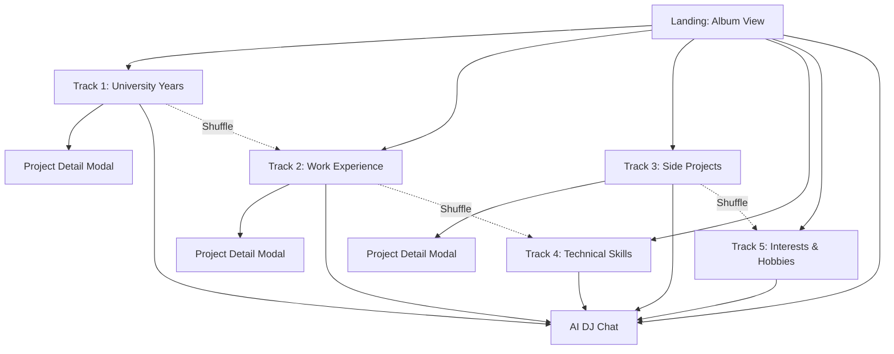
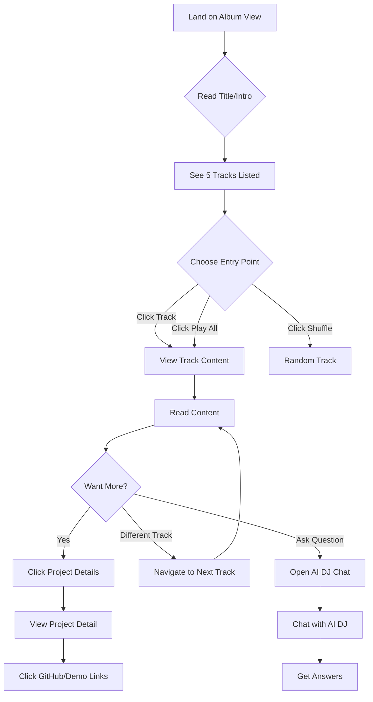
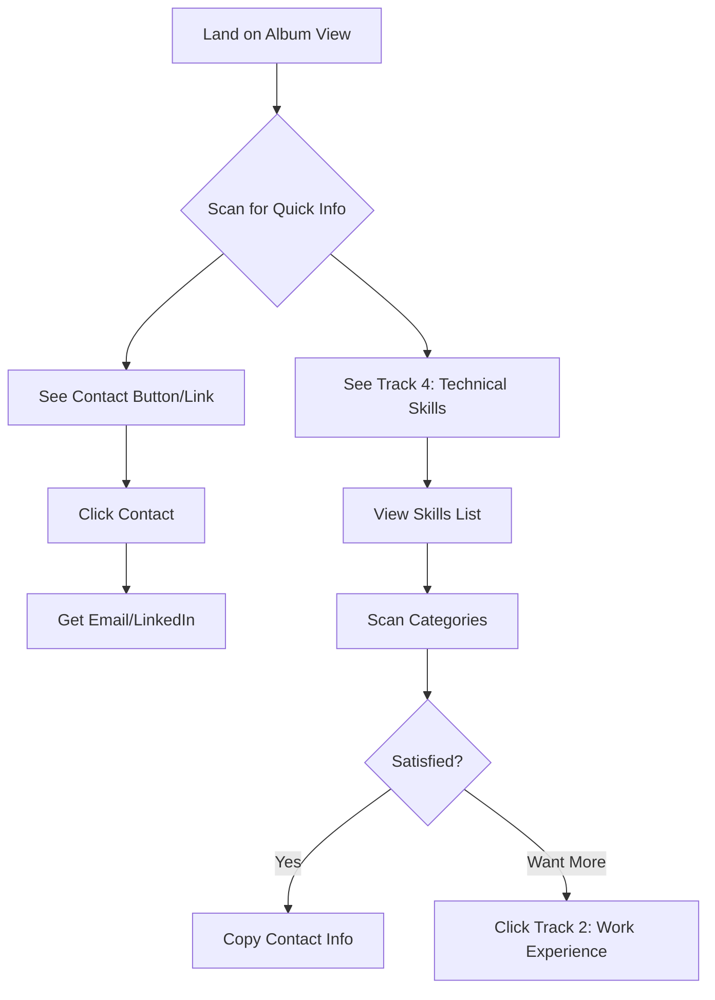
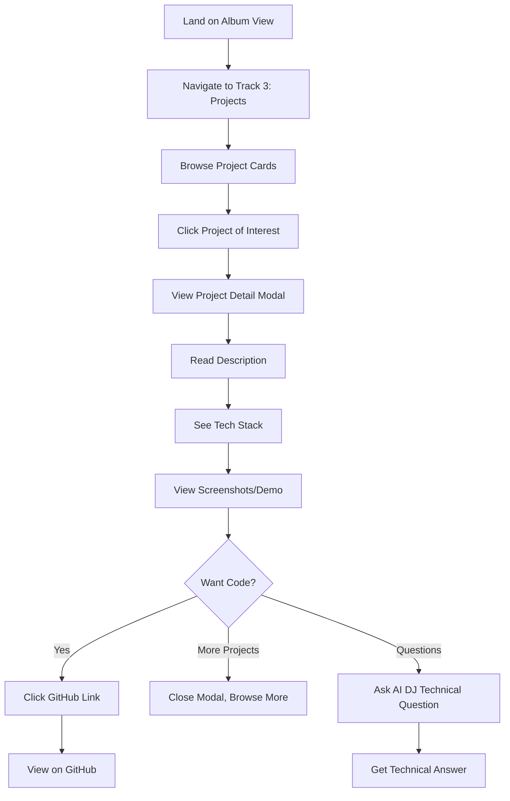

# Diego Portfolio - UI/UX Specification

## Introduction

This document defines the user experience goals, information architecture, user flows, and visual design specifications for Diego Portfolio's user interface. It serves as the foundation for visual design and frontend development, ensuring a cohesive, music-inspired experience that showcases Diego's technical skills while remaining accessible and user-friendly.

The portfolio reimagines the traditional developer portfolio as an immersive music streaming experience, where each section ("track") of Diego's professional journey is presented with the familiar, intuitive interface patterns of Spotify or Apple Music, enhanced with interactive AI chat capabilities and audio-reactive visualizations.

### Change Log

| Date | Version | Description | Author |
|------|---------|-------------|--------|
| 2025-01-14 | 1.0 | Initial UI/UX specification | Sally (UX Expert) |

---

## Overall UX Goals & Principles

### Target User Personas

**Persona 1: The Hiring Manager**
- **Background:** Technical hiring manager at a tech company, reviews 10-20 portfolios weekly
- **Goals:** Quickly assess technical skills, see evidence of work, gauge cultural fit
- **Pain Points:** Tired of cookie-cutter portfolios, needs quick filtering, wants to remember candidates
- **Needs:** Fast access to skills and projects, contact info, memorable differentiation

**Persona 2: The Technical Recruiter**
- **Background:** Non-technical recruiter sourcing candidates, less technical depth but highly motivated
- **Goals:** Understand candidate's experience level, find contact info, share portfolio with team
- **Pain Points:** Technical jargon overload, unclear experience levels, hard-to-navigate sites
- **Needs:** Clear summaries, visual skill indicators, easy sharing, quick contact

**Persona 3: The Engineering Peer**
- **Background:** Senior developer or tech lead evaluating technical depth for team fit
- **Goals:** Deep dive into projects, assess code quality, understand technical choices
- **Pain Points:** Surface-level portfolios, missing GitHub links, no technical details
- **Needs:** Direct links to code, technical depth, clear architecture explanations

### Usability Goals

1. **Immediate Engagement:** Visitors understand the unique concept within 5 seconds
2. **Efficient Navigation:** Users can find specific information (skills, projects, contact) within 30 seconds
3. **Memorable Experience:** 90%+ of visitors remember "the music portfolio" weeks later
4. **Low Friction:** No forced interactions, intuitive controls, respectful of user preferences
5. **Professional + Creative Balance:** Showcases creativity without sacrificing professionalism

### Design Principles

1. **"Familiar Yet Fresh"** - Use established music player patterns (Spotify, Apple Music) but add unique touches that surprise and delight

2. **"Let the Music Guide"** - Audio and visuals work together to create atmosphere, but never distract from content

3. **"Accessible Creativity"** - Innovative design never comes at the expense of usability or accessibility

4. **"Progressive Disclosure"** - Surface key information immediately, depth available on demand

5. **"Respect User Agency"** - No auto-play, no forced interactions, users control their experience

---

## Information Architecture

### Site Map / Screen Inventory



### Navigation Structure

**Primary Navigation:**
- Album view serves as home/hub
- Track list visible at all times (sidebar on desktop, menu on mobile)
- Current track highlighted in navigation
- Shuffle button always accessible

**Secondary Navigation:**
- Previous/Next track buttons
- Return to Album View button
- Quick links within track content

**Breadcrumb Strategy:**
Not needed - music player paradigm doesn't use breadcrumbs. Track indicator (e.g., "Track 2 of 5") provides context.

---

## User Flows

### Flow 1: First-Time Visitor Explores Portfolio

**User Goal:** Understand who Diego is and what he can do

**Entry Points:** Direct URL, LinkedIn link, QR code from resume

**Success Criteria:** User explores at least 2 tracks and understands Diego's key skills

**Flow Diagram:**



**Edge Cases & Error Handling:**
- **Slow Connection:** Progressive loading with skeleton screens
- **No Audio Support:** Visual-only experience with message about audio
- **Broken Links:** Graceful 404 with return to album view
- **Chat API Down:** Friendly error message, alternative contact info shown

**Notes:** First impression is critical. Landing page must immediately communicate the unique concept while remaining professional.

---

### Flow 2: Recruiter Looking for Specific Information

**User Goal:** Quickly find contact info and assess technical skills

**Entry Points:** Direct URL from application, LinkedIn

**Success Criteria:** Find contact info within 30 seconds, understand skill level

**Flow Diagram:**



**Edge Cases & Error Handling:**
- **Contact Link Broken:** Multiple contact methods visible
- **Skills Too Technical:** AI DJ offers to explain
- **Mobile Viewing:** Touch-optimized, easy scrolling

**Notes:** Must support quick "scan and extract" behavior without forcing engagement with full experience.

---

### Flow 3: Developer Deep Dive into Projects

**User Goal:** Assess technical depth and code quality

**Entry Points:** Shared link, GitHub profile link

**Success Criteria:** View multiple projects, access GitHub repos, understand technical choices

**Flow Diagram:**



**Edge Cases & Error Handling:**
- **GitHub Link Broken:** Alternative demo/documentation links provided
- **No Project Details:** AI DJ can provide more context
- **Large Images:** Lazy loading, optimized formats

**Notes:** This user wants depth, not fluff. Provide direct access to code and technical details.

---

## Wireframes & Mockups

### Primary Design Files

**Design Tool:** Figma  
**File Location:** [To be created - recommend Figma for design system and component library]

### Key Screen Layouts

#### Screen: Album View (Landing Page)

**Purpose:** First impression, portfolio overview, entry point to all tracks

**Key Elements:**
- Hero section with portfolio title "Diego Portfolio" and tagline
- Album artwork or hero visual (abstract, music-themed)
- Track listing showing all 5 tracks with numbers, titles, brief descriptions
- Large "Play" or "Start Experience" button
- Visual indicators for features (AI DJ, Interactive Visualizations)
- Subtle music-themed design elements (vinyl record, waveforms, play buttons)

**Interaction Notes:**
- Hovering track shows preview or animation
- Play button begins from Track 1
- Shuffle button visible for random entry
- Scroll to see all tracks on mobile

**Layout Structure:**
```
┌─────────────────────────────────────┐
│         DIEGO PORTFOLIO             │
│    Where Tech Meets Music 🎵        │
│                                     │
│     [Large Album Artwork]           │
│                                     │
│  ► PLAY ALL      🔀 SHUFFLE        │
│                                     │
│  🎵 Track 1: University Years       │
│     Foundation & Learning           │
│                                     │
│  🎵 Track 2: Work Experience        │
│     Professional Growth             │
│                                     │
│  🎵 Track 3: Side Projects          │
│     Passion & Innovation            │
│                                     │
│  🎵 Track 4: Technical Skills       │
│     The Tech Stack                  │
│                                     │
│  🎵 Track 5: Interests & Hobbies    │
│     Beyond Code                     │
│                                     │
│   [AI DJ] [Contact] [Resume]       │
└─────────────────────────────────────┘
```

---

#### Screen: Track View (Individual Track Page)

**Purpose:** Display track-specific content with audio and visuals

**Key Elements:**
- Track header (number, title, description)
- Audio player controls (play/pause, timeline, volume, mute)
- Audio visualization canvas (full-width or background)
- Main content area (scrollable)
- Track navigation (previous/next)
- AI DJ chat button (floating or sidebar)
- Return to album view button

**Interaction Notes:**
- Audio controls sticky/fixed position
- Visualization reacts to audio in real-time
- Content scrolls independently of controls
- Smooth transitions between tracks

**Layout Structure (Desktop):**
```
┌────────────────────────────────────────────┐
│  ← Album View    🎵 Track 2 of 5    Next → │
├────────────────────────────────────────────┤
│                                            │
│         [Audio Visualization]              │
│                                            │
├────────────────────────────────────────────┤
│  ⏯️ ━━━━━━━●─────  🔊 ──●  🔀            │
│  2:45                    3:52              │
├────────────────────────────────────────────┤
│                                            │
│  WORK EXPERIENCE                           │
│                                            │
│  📍 Company Name | Role                    │
│  📅 Dates                                  │
│  • Responsibility 1                        │
│  • Responsibility 2                        │
│  • Achievement with metrics                │
│                                            │
│  [Content continues, scrollable...]        │
│                                            │
└────────────────────────────────────────────┘
                                    [AI DJ 💬]
```

---

#### Screen: AI DJ Chat Interface

**Purpose:** Interactive Q&A about Diego's background

**Key Elements:**
- Chat header with AI DJ branding/personality
- Conversation thread (scrollable)
- Message input field
- Send button
- Suggested questions (chips/bubbles)
- Clear/reset conversation button
- Close button

**Interaction Notes:**
- Opens as modal, drawer, or sidebar
- Accessible from any page
- Messages stream in (typing indicator)
- "Want more details?" appears after summary responses
- Suggested questions clickable

**Layout Structure:**
```
┌───────────────────────────────┐
│  🎧 AI DJ - Ask Me Anything   │ [✕]
├───────────────────────────────┤
│                               │
│  DJ: Hey! I'm here to answer  │
│      questions about Diego.   │
│      What would you like to   │
│      know?                    │
│                               │
│         You: What projects    │
│         has Diego worked on?  │
│                               │
│  DJ: Diego has built several  │
│      cool projects including  │
│      a music recommender...   │
│                               │
│      [💬 Want more details?]  │
│                               │
│  [Suggested: What are Diego's │
│   strongest skills?]          │
│                               │
├───────────────────────────────┤
│  [Type your question...]   [→]│
└───────────────────────────────┘
```

---

## Component Library / Design System

### Design System Approach

**Foundation:** Custom design system built specifically for Diego Portfolio, optimized for music-themed interface with modern, accessible components.

**Component Philosophy:**
- Reusable, composable components
- Consistent props API across similar components
- Accessibility built-in by default
- Theme-aware (supports visual variations per track)

### Core Components

#### Component: AudioPlayer

**Purpose:** Global audio playback controls

**Variants:** 
- Full (desktop) - all controls visible
- Compact (mobile) - essential controls only

**States:**
- Playing
- Paused
- Loading
- Error (audio failed to load)

**Usage Guidelines:**
- Always visible when audio is available
- Sticky positioning (bottom of viewport)
- Controls remain accessible while scrolling
- Keyboard shortcuts supported (spacebar = play/pause)

---

#### Component: TrackCard

**Purpose:** Displays track in album view listing

**Variants:**
- Default (in list)
- Featured (larger, hero-style)
- Compact (mobile)

**States:**
- Default
- Hover (preview animation)
- Active (currently playing)
- Disabled

**Usage Guidelines:**
- Clickable entire card
- Track number always visible
- Brief description truncated at 2 lines
- Smooth hover transitions

---

#### Component: Visualization Canvas

**Purpose:** Real-time audio-reactive visual display

**Variants:**
- Frequency Bars
- Waveform
- Particles
- Circular (radial)

**States:**
- Active (audio playing, animating)
- Paused (static/frozen)
- Loading

**Usage Guidelines:**
- Full-width or background element
- Never blocks content
- Performance-optimized (30+ FPS)
- Responsive to screen size

---

#### Component: ChatMessage

**Purpose:** Individual message in AI DJ conversation

**Variants:**
- User Message (right-aligned, different style)
- AI Message (left-aligned, DJ personality)
- System Message (centered, low emphasis)

**States:**
- Sending
- Sent
- Error

**Usage Guidelines:**
- Timestamp optional
- "More details" button inline
- Suggested questions as chips
- Markdown support for formatting

---

#### Component: ProjectCard

**Purpose:** Display project in grid or list

**Variants:**
- Grid Card (image + title + brief)
- List Item (horizontal layout)
- Featured (larger with more detail)

**States:**
- Default
- Hover (lift effect, show "View Details")
- Loading

**Usage Guidelines:**
- Always shows tech stack tags
- Links prominently displayed
- Image optimized and lazy-loaded
- Click anywhere to open details

---

#### Component: NavigationSidebar

**Purpose:** Track list navigation

**Variants:**
- Desktop (always visible sidebar)
- Mobile (hamburger menu drawer)

**States:**
- Expanded
- Collapsed
- Active track highlighted

**Usage Guidelines:**
- Current track visually distinct
- Click track to navigate
- Close on mobile after selection
- Keyboard accessible

---

## Branding & Style Guide

### Visual Identity

**Brand Guidelines:** 
Diego Portfolio brand is modern, technical, and creative with strong music influences. The visual identity balances professional polish with playful creativity, appealing to tech recruiters while showcasing personality.

**Design Inspiration:**
- Spotify's clean, dark interface
- Apple Music's typography and spacing
- SoundCloud's waveform visualizations
- Modern portfolio sites (Awwwards winners)
- Synthwave/retrowave aesthetics (subtle influence)

### Color Palette

| Color Type | Hex Code | Usage | Notes |
|------------|----------|-------|-------|
| **Primary** | #1DB954 | CTA buttons, active states, accents | Spotify-inspired green, energetic |
| **Secondary** | #6366F1 | Links, secondary actions | Indigo, tech-forward |
| **Accent** | #F59E0B | Highlights, special elements | Amber, warm contrast |
| **Success** | #10B981 | Positive feedback, completed states | Emerald green |
| **Warning** | #F59E0B | Cautions, important notices | Amber (same as accent) |
| **Error** | #EF4444 | Errors, destructive actions | Red, clear alert |
| **Background Dark** | #0F172A | Main background | Slate 900, rich dark |
| **Background Light** | #1E293B | Cards, elevated surfaces | Slate 800 |
| **Text Primary** | #F8FAFC | Main text, headings | Slate 50, high contrast |
| **Text Secondary** | #CBD5E1 | Secondary text, captions | Slate 300, readable |
| **Border** | #334155 | Dividers, borders | Slate 700, subtle |

**Accessibility Notes:**
- All color combinations meet WCAG AA (4.5:1 contrast minimum)
- Primary green on dark background: 4.8:1 contrast
- Text primary on background dark: 18:1 contrast

### Typography

#### Font Families

- **Primary (Headings):** 'Inter', system-ui, -apple-system, sans-serif
- **Secondary (Body):** 'Inter', system-ui, -apple-system, sans-serif
- **Monospace (Code):** 'Fira Code', 'Courier New', monospace

**Rationale:** Inter is modern, highly readable, excellent for interfaces, and includes proper font weights. Single font family creates cohesion while reducing page weight.

#### Type Scale

| Element | Size | Weight | Line Height | Usage |
|---------|------|--------|-------------|-------|
| **H1** | 48px (3rem) | 700 Bold | 1.2 | Page titles, hero |
| **H2** | 36px (2.25rem) | 600 Semibold | 1.3 | Section headings |
| **H3** | 24px (1.5rem) | 600 Semibold | 1.4 | Subsections, track titles |
| **H4** | 20px (1.25rem) | 600 Semibold | 1.5 | Component headers |
| **Body Large** | 18px (1.125rem) | 400 Regular | 1.6 | Intro paragraphs, emphasis |
| **Body** | 16px (1rem) | 400 Regular | 1.6 | Main content, descriptions |
| **Body Small** | 14px (0.875rem) | 400 Regular | 1.5 | Captions, metadata, labels |
| **Tiny** | 12px (0.75rem) | 500 Medium | 1.4 | Tags, timestamps, smallest text |

### Iconography

**Icon Library:** Lucide Icons (https://lucide.dev)

**Usage Guidelines:**
- Use outline style for consistency
- Icon size: 20px (default), 24px (prominent actions), 16px (inline)
- Always pair icons with text labels for accessibility
- Use semantic icons (play = ▶️, pause = ⏸️, etc.)

**Common Icons:**
- Play: `play-circle`
- Pause: `pause-circle`
- Shuffle: `shuffle`
- Next: `skip-forward`
- Previous: `skip-back`
- Volume: `volume-2`, `volume-x` (muted)
- Chat: `message-circle`
- External Link: `external-link`
- GitHub: `github` (brand icon)

### Spacing & Layout

**Grid System:** 
12-column grid with consistent gutters

**Container Max Width:**
- Desktop: 1280px
- Tablet: 100% with padding
- Mobile: 100% with padding

**Spacing Scale (Tailwind-inspired):**
- 4px (0.25rem) - xs
- 8px (0.5rem) - sm
- 12px (0.75rem) - md
- 16px (1rem) - base
- 24px (1.5rem) - lg
- 32px (2rem) - xl
- 48px (3rem) - 2xl
- 64px (4rem) - 3xl
- 96px (6rem) - 4xl

**Layout Principles:**
- Generous whitespace for breathing room
- Consistent padding within cards/sections (24px desktop, 16px mobile)
- Sections separated by 48-64px vertically
- Related content grouped with less spacing (8-16px)

---

## Accessibility Requirements

### Compliance Target

**Standard:** WCAG 2.1 Level AA

**Priority:** Accessibility is a first-class requirement, not an afterthought. Every component must be usable by keyboard, screen reader, and assistive technologies.

### Key Requirements

**Visual:**
- **Color Contrast Ratios:** 4.5:1 minimum for normal text, 3:1 for large text (18px+)
- **Focus Indicators:** Visible focus ring on all interactive elements (2px solid, high contrast)
- **Text Sizing:** User can zoom to 200% without loss of functionality

**Interaction:**
- **Keyboard Navigation:** All functionality available via keyboard (Tab, Enter, Space, Arrows, Esc)
- **Screen Reader Support:** Proper ARIA labels, roles, and live regions for dynamic content
- **Touch Targets:** Minimum 44x44px for mobile touch targets

**Content:**
- **Alternative Text:** All images have descriptive alt text (decorative images marked with alt="")
- **Heading Structure:** Logical heading hierarchy (H1 → H2 → H3, no skipping levels)
- **Form Labels:** All inputs have associated labels or aria-label

### Specific Accessibility Features

**Audio Player:**
- ARIA labels for all controls
- Keyboard shortcuts announced to screen readers
- Visual indication of playback state
- Volume level announced when changed

**Navigation:**
- Skip to main content link
- Breadcrumb or track indicator for context
- Keyboard shortcuts for track navigation (documented)

**Chat Interface:**
- Live region announces new messages
- Input field properly labeled
- Send button keyboard accessible
- Clear conversation keyboard shortcut

**Visualizations:**
- Alternative text describes what visualization represents
- Not critical to content understanding (enhancement only)
- Can be disabled if causing seizure risk (unlikely but checked)

### Testing Strategy

**Automated Testing:**
- axe DevTools for automated checks
- Lighthouse accessibility audit (100 score target)
- Pa11y CI for continuous testing

**Manual Testing:**
- Keyboard-only navigation
- Screen reader testing (NVDA on Windows, VoiceOver on Mac/iOS)
- Zoom testing (200% browser zoom)
- Color blindness simulation

---

## Responsiveness Strategy

### Breakpoints

| Breakpoint | Min Width | Max Width | Target Devices | Layout Changes |
|------------|-----------|-----------|----------------|----------------|
| **Mobile** | 320px | 767px | Phones | Single column, stacked layout, hamburger menu |
| **Tablet** | 768px | 1023px | Tablets, small laptops | 2-column where appropriate, larger touch targets |
| **Desktop** | 1024px | 1279px | Laptops, small desktop | Full layout, sidebar navigation, multi-column |
| **Wide** | 1280px | - | Large desktop, ultra-wide | Max-width container, enhanced visualizations |

### Adaptation Patterns

**Layout Changes:**
- **Mobile:** Single column, vertical stack, bottom-aligned audio player
- **Tablet:** 2-column grid for projects, side-by-side elements where space allows
- **Desktop:** Sidebar navigation always visible, multi-column layouts, floating AI DJ

**Navigation Changes:**
- **Mobile:** Hamburger menu (☰) reveals track list, bottom navigation bar
- **Tablet:** Collapsible sidebar, hybrid approach
- **Desktop:** Always-visible sidebar with all tracks listed

**Content Priority:**
- **Mobile:** Essential info first, "show more" patterns for detail
- **Tablet:** More content visible, less truncation
- **Desktop:** Full content visible, detailed views default

**Interaction Changes:**
- **Mobile:** Touch-optimized (larger targets, swipe gestures), simplified visualizations
- **Tablet:** Hybrid touch + cursor, medium complexity
- **Desktop:** Hover states, keyboard shortcuts, full-featured visualizations

### Mobile-Specific Considerations

**Touch Targets:**
- Minimum 44x44px for all interactive elements
- Extra padding around small buttons
- Swipe gestures for track navigation (optional)

**Performance:**
- Simplified visualizations on mobile
- Lazy loading more aggressive
- Smaller audio file quality options
- Reduce animation complexity

**UI Adaptations:**
- Bottom sheet for AI DJ chat
- Fixed bottom player with minimal controls
- Full-screen track view (no sidebar)
- Pull-to-refresh (optional)

---

## Animation & Micro-interactions

### Motion Principles

**Philosophy:** Animations should feel smooth, purposeful, and respect user preferences (prefers-reduced-motion). Music-themed portfolio can have more personality than typical site, but never distract.

**Duration Guidelines:**
- **Fast (100-200ms):** Hover effects, button presses, small UI changes
- **Medium (200-400ms):** Panel transitions, modal open/close, page transitions
- **Slow (400-800ms):** Complex animations, visualizations, entrance effects

**Easing Functions:**
- **Ease-out:** Most UI transitions (starts fast, slows to stop)
- **Ease-in-out:** Smooth both ways (modals, page transitions)
- **Spring:** Playful elements (like buttons, cards)

### Key Animations

**Track Card Hover:**
- **Effect:** Subtle lift (translate Y: -4px), shadow increase, scale: 1.02
- **Duration:** 200ms ease-out
- **Trigger:** Mouse hover, keyboard focus

**Track Transition:**
- **Effect:** Fade out current, fade in next with slight slide
- **Duration:** 400ms ease-in-out
- **Trigger:** Track navigation

**Audio Visualization:**
- **Effect:** Continuous, real-time response to frequency data
- **Duration:** Frame-by-frame (60fps target)
- **Trigger:** Audio playing

**Chat Message Appearance:**
- **Effect:** Fade + slide from bottom
- **Duration:** 300ms ease-out
- **Trigger:** New message received

**Button Press:**
- **Effect:** Scale down slightly (0.95), color darken
- **Duration:** 100ms ease-out
- **Trigger:** Click, tap, Enter key

**Modal Open:**
- **Effect:** Backdrop fade in, modal slide up + fade in
- **Duration:** 300ms ease-out
- **Trigger:** Click project card, open chat

**Shuffle Activation:**
- **Effect:** Shuffle icon spin, track list briefly scrambles visually
- **Duration:** 400ms ease-in-out
- **Trigger:** Click shuffle button

### Micro-interactions

**Audio Player:**
- Play button morphs to pause
- Progress bar scrubbing shows hover tooltip with time
- Volume slider expands on hover
- Mute icon changes based on state

**Project Cards:**
- Tags/tech stack animate in on hover (stagger effect)
- "View Details" text fades in
- Background color shifts subtly

**AI DJ Chat:**
- Typing indicator (three dots bounce)
- "Want more details?" button pulses gently
- Suggested questions fade in after response

**Track Navigation:**
- Active track pulses subtly
- Next track preview on hover (shows first line of content)

---

## Performance Considerations

### Performance Goals

- **Page Load:** First Contentful Paint < 1.5s, Largest Contentful Paint < 2.5s
- **Interaction:** Response to user input < 100ms
- **Animation FPS:** 60fps for smooth animations, 30fps minimum for visualizations
- **Bundle Size:** Initial JS < 200KB gzipped

### Design Strategies

**Image Optimization:**
- Use WebP format with JPEG fallback
- Responsive images (srcset) for different screen sizes
- Lazy loading for below-fold images
- Blur-up placeholders for smooth loading

**Code Splitting:**
- Route-based code splitting (each track = separate bundle)
- Component lazy loading (modals, chat interface)
- Defer non-critical features (analytics, share buttons)

**Re-render Optimization:**
- Memoize expensive calculations
- Use React.memo for pure components
- Avoid unnecessary state updates
- Optimize visualization rendering (RAF, debounce)

**Audio Performance:**
- Compressed, optimized audio files (MP3 or AAC, 128-192kbps)
- Progressive streaming for audio
- Preload next track audio
- Cancel requests when navigating away

---

## Next Steps

### Immediate Actions

1. **Create Visual Mockups in Figma**
   - Design album view, track pages, chat interface
   - Define exact visual style, colors, and spacing
   - Create component library in Figma

2. **Validate with User Testing (Optional)**
   - Show mockups to 3-5 potential users (recruiters, developers)
   - Gather feedback on clarity, usability, and appeal
   - Iterate based on feedback

3. **Prepare Design Assets**
   - Export icons and graphics
   - Document component specifications
   - Create design system documentation

4. **Handoff to Architecture**
   - Provide UX spec to architect for technical implementation planning
   - Collaborate on technical feasibility

### Design Handoff Checklist

- [x] Overall UX vision defined
- [x] User flows documented
- [x] Component library specified
- [x] Accessibility requirements detailed
- [x] Responsive strategy defined
- [x] Animation guidelines provided
- [ ] Visual mockups created in Figma
- [ ] Design assets exported
- [ ] Component specs finalized
- [ ] Design system documented

